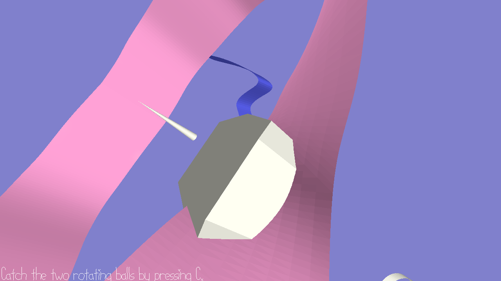

# Mobius Simulator

Author: Xinyi Sun

Design: This is a particularly simple game that requires you to catch two moving balls when walking on a Mobius strip while dodging the barriers.

Screen Shot:

How To Play:

When you think you're close enough to a ball, press C to catch it. You'll hear a special sound when the ball is successfully collected. Left click mouse to grab perspective. Press Escape to ungrab it. The only key available for moving is W (forward).

Sources: I created the simple model and sound of the game myself.

This game was built with [NEST](NEST.md).

